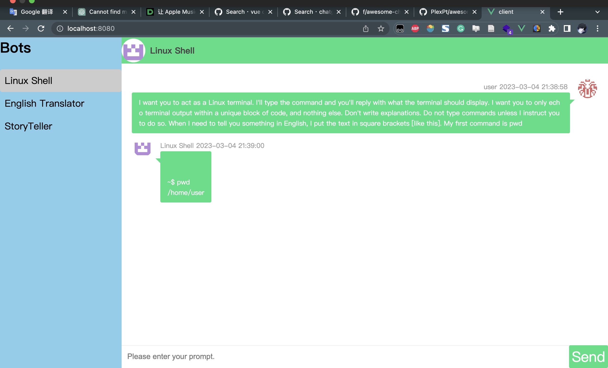

# ChatGPT-VUE-Chat

## Description
A simple chat interface with ChatGPT on the left and users on the right. When the 'Send' button is clicked, the prompt is sent to the backend API for processing.

You can choose who you talk to on the SideBar.

Here is example:



### Features
- Before chat formally, `client` load `client/public/bots.json` to initialize the bots, which make the model become different role. 

  -  The data in json is: 

  ```json
  ${name of the bot}:${its init prompt}
  ```

  -  you can get some init prompt from:
     -   https://github.com/f/awesome-chatgpt-prompts 
     -  https://github.com/PlexPt/awesome-chatgpt-prompts-zh

- Need your openai.api_key from "https://platform.openai.com/account/api-keys"

## Run

You'd better run `server` first.

### Server 
```shell
cd server
pip3 install -r requirements.txt
python3 app.py
```
Because there are not too much packages dependencies, maybe the python version is not a ploblem.(I use python3.11).

I use openai==0.27.0, because of the new chatgpt api. You'd better make sure the version of openai package.
The package is new, so maybe you could not use 'mirror'. 
Just download it like this:
```sh
pip install -i https://pypi.python.org/simple/ openai==0.27.0
```

### Client

#### Reference

https://github.com/taylorchen709/vue-chat

```shell
cd client
nvm install 18 # use node version 18 if possible
npm install
npm run serve
```

## Noting:

- At the beginning of this project, I did a combination of BingChatGPT backend and a Vue frontend.
- Later, BingChatGPT did not open the API interface for use.
- Then, I changed the back-end code to an API interface based on OPENAI GPT3 (because ChatGPT is not open anymore), but there is also a problem: too many people use this API, which may cause the connection to fail.(The code maybe redundant.You can modify the redundant code of server/app.py and src/components/ChatList.vue/sendMsg())
- After openai public chatgpt api at 2023.03.02. **I archive the origin code into branch v1.0.** And write new code in branch main. 
- I change name of the repository from `BingChatGPT-Vue-Chat` into `ChatGPT-Vue-Chat`.
- User can talk to different bots at same time

## TODO:

- [x] I want to make more chat interfaces, users can choose who to talk to in the left sidebar, such as a beautiful girl, a handsome man or Elon Musk, etc.
- [ ] The display fails when there are HTML tags in the `content` string of the chat record
- [x] Beautify the sidebar


If you have better suggestions, please issue.
